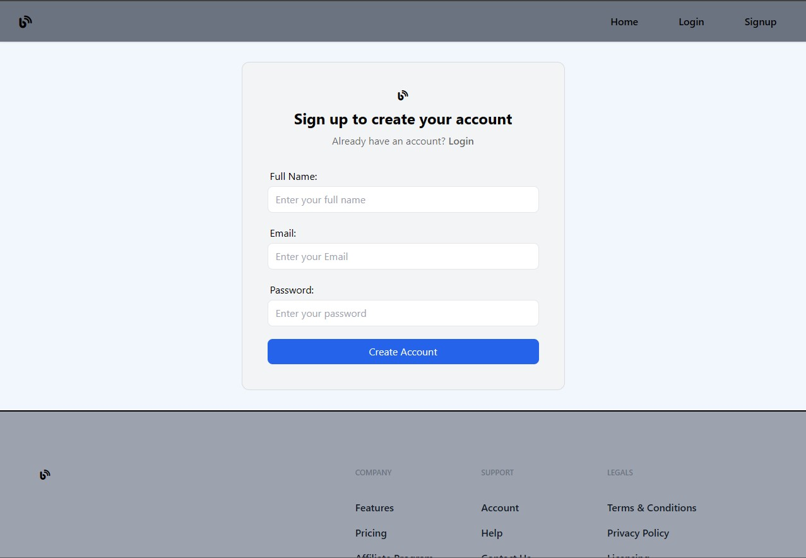
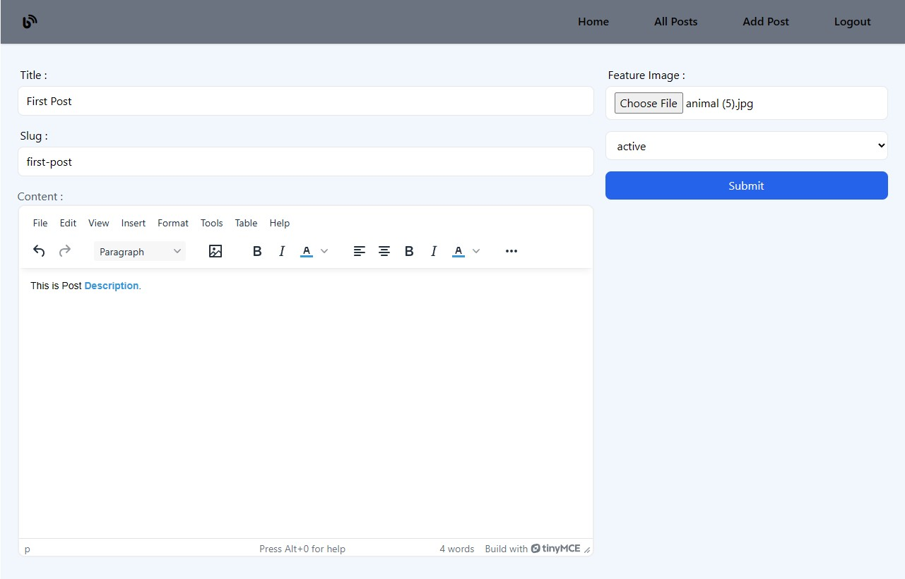
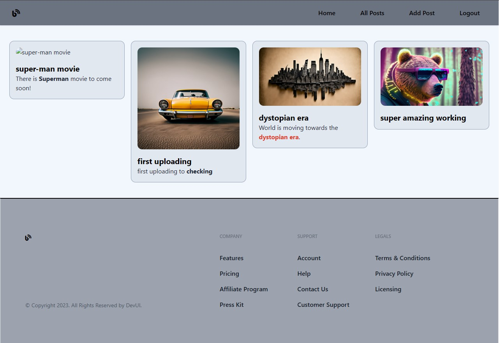

# 🚀 React & Appwrite Blog Platform

A full-stack blog application built using **React**, **Redux Toolkit**, and **Appwrite** as the backend service. This project demonstrates core concepts of frontend-backend integration, user authentication, protected routes, file uploads, and global state management.

Experience Here: [Live Link](https://blog-myapp.netlify.app) 

---

## 📸 Preview







---

## ✨ Features

### 🔐 Appwrite Backend

* User Authentication: Login, Register, Session Management
* CRUD Operations for Posts

  * Create, Read, Update, Delete
* File upload support (image/file attachment to posts)
* File management: Get preview, delete files

### ⚛️ Frontend (React + Redux Toolkit)

* Global state management using Redux Toolkit
* API integration with custom React hooks
* Authentication (login/register)
* Protected routes via React Router
* UI feedback with loading/error/success states
* Toast notifications (e.g., success, error alerts)

---

## ⚙️ Setup Instructions

### 🔧 Prerequisites

* **Node.js** installed
* An **Appwrite** project with necessary collections, buckets, etc.

---

### 🔨 Frontend Installation

```bash
git clone <repo-url>
cd mern-auth-project
npm install
```

---

### 📄 Environment Variables

Create a `.env` file in the project root:

```env
# Appwrite Configuration
VITE_APPWRITE_URL=""
VITE_APPWRITE_PROJECT_ID=""
VITE_APPWRITE_DATABASE_ID=""
VITE_APPWRITE_COLLECTION_ID=""
VITE_APPWRITE_BUCKET_ID=""

# Cloudinary (for external file hosting)
VITE_CLOUDINARY_CLOUD_NAME=""
VITE_CLOUDINARY_UPLOAD_PRESENT=""
```

---

### ▶️ Start the Development Server

```bash
npm run dev
```

---

## 📡 API Endpoints

### 🔑 Authentication

| Function           | Description                     |
| ------------------ | ------------------------------- |
| `createAccount()`  | Register a new user             |
| `login()`          | Login and receive session token |
| `getCurrentUser()` | Get currently logged-in user    |
| `logout()`         | Terminate session               |

### 📝 Posts & Files

| Function           | Description                 |
| ------------------ | --------------------------- |
| `createPost()`     | Create a new blog post      |
| `updatePost()`     | Update an existing post     |
| `deletePost()`     | Delete a post               |
| `getPost()`        | Get single post by ID       |
| `getPosts()`       | Get all posts               |
| `uploadFile()`     | Upload a file to Appwrite   |
| `deleteFile()`     | Remove a file from Appwrite |
| `getFilePreview()` | Get file preview URL        |

---

## 📁 Folder Structure

```
mern-auth-project/
│
├── src/
│   ├── appwrite/       # API utilities & hooks
│   ├── components/     # Reusable components (UI, logic)
│   ├── conf/           # Config & env variables
│   ├── store/          # Redux slices & store
│   ├── pages/          # Page-level components
│   ├── App.js          # Root App component
│   └── index.js        # Entry point
│
├── public/             # Static files
├── .env                # Environment config
└── package.json        # Project metadata & scripts
```

---

## 🛠️ Technologies Used

### 🔧 Frontend

* React.js
* Redux Toolkit
* React Router
* Appwrite JS SDK
* Cloudinary (optional for media storage)
* React Toastify (for notifications)

---

## 🌱 Future Improvements

* Add post state management (draft, published, etc.)
* User profile management (edit profile, upload avatar)
* Store posts and auth data in LocalStorage
* Image hosting via Cloudinary or external service
* Add advanced blog features:

  * Public blog feed with likes & views
  * Blog analytics dashboard
  * Visibility toggles for posts (public/private)

---

## 🎯 Learning Outcomes

By completing this project, you'll learn:

✅ How to build a full-stack app with React & Appwrite
✅ How to structure scalable React projects
✅ How to manage global state with Redux Toolkit
✅ How to implement authentication and protected routes
✅ How to handle file uploads and previews

---

## 📄 License

This project is open-source and available under the **MIT License**.

